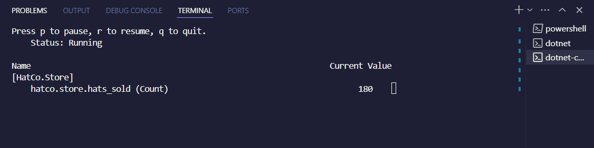
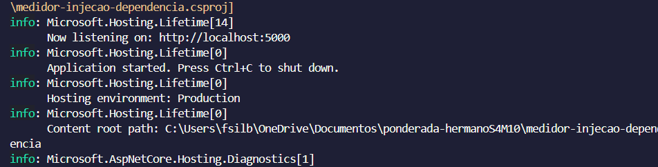
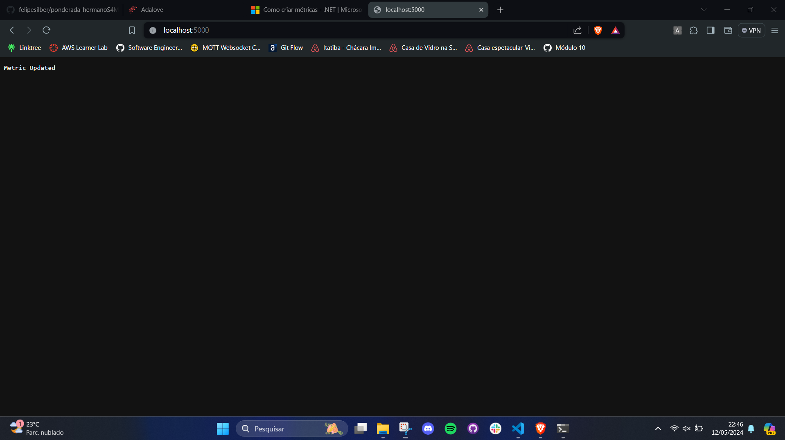

# Ponderada Métricas - Semana 4 Módulo 10

## Introdução

Este documento possui como objetivo esclarecer acerca do processo de implementação do controle de uma métrica personalizada utilizando **dotnet**, passando conceitos aprendidos, bem como evidências de execução.

## Conceitos aprendidos

- Criação de métrica personalizada
- Monitoramento da métrica criada
- Utilização do dotnet para construção do projeto

## Evidências de execução

### Métrica personalizada

### Medidor com Injeção de Dependência

## Conclusão

Após a implementação do passo a passo do tutorial do Autoestudo, ficou evidente sua relevância e atuação no contexto do módulo, haja vista que será necessário para a implementação de métricas personalizadas para controle e monitoramento da aplicação do módulo, além de contribuir com meu conhecimento técnico pessoal.